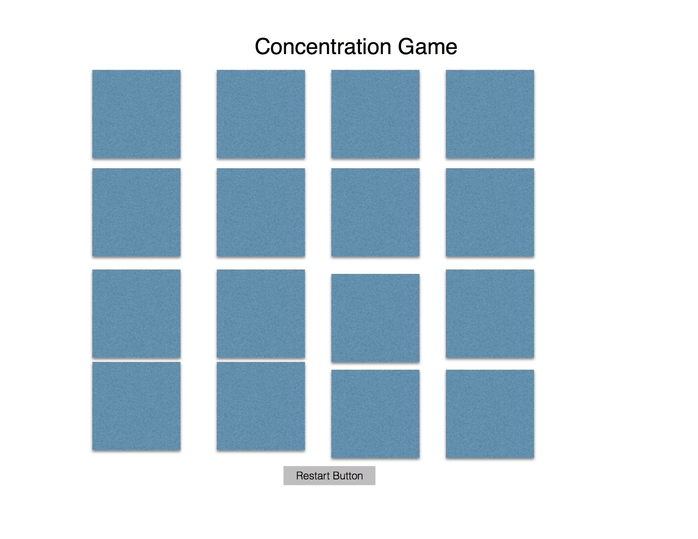

# WDI-Project-1-Concentration

### User Stories

1. User can flip over a card

2. If the user clicks on another card and it matches, they stay

3. If the user clicks on another card and it does not match they both flip back over

4. Each selected card should be assigned to a variable (at least). A user should only be able to select two cards at a time. If the cards do not match, each card will de-selected. And then the user should select two more cards.

5. The game is over when the user has matched all the cards

### Front-End Wireframes

### List of Technologies Used

1. HTML

2. jQuery

3. Javascript

4. CSS

### Description of the Game

A fun, easy, classic game. Match all the tiles for a win!

### Link to Playable